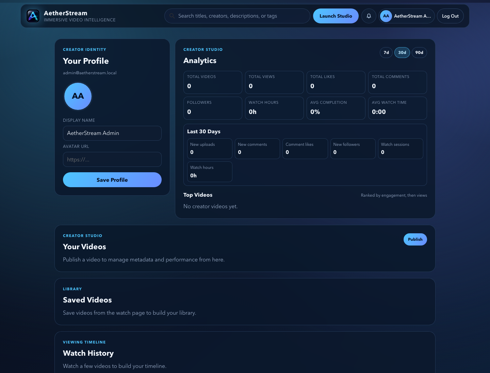
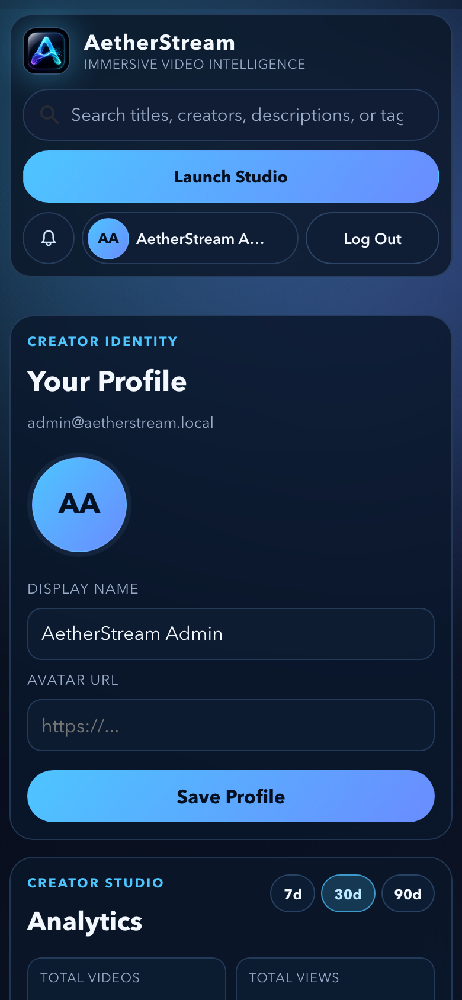

# AetherStream

Futuristic, subtle redesign of the BrainFlix app with a refreshed product identity and premium streaming UI.

## Highlights

- Rebranded app shell and metadata (`AetherStream`)
- Glassmorphism-inspired interface with ambient gradients
- Search-powered "Up Next" rail filter
- Cinematic hero overlay with live content chips
- Elevated article, comments, and response composer cards
- Rebuilt upload studio with:
  - live title/description preview
  - character counters
  - improved publish validation and loading state

## Screenshots

Captured from the local app with Chrome headless after signing in through the admin demo login.





## Run Locally

```bash
npm install
npm start
```

API is expected at `http://localhost:8080/`.

## Build

```bash
npm run build
```

## Maintenance

Dependabot checks npm dependencies and GitHub Actions weekly, groups minor and patch updates, and leaves major upgrades for manual review.

```bash
npm run audit
npm run audit:prod
npm run audit:fix
npm run build
```
