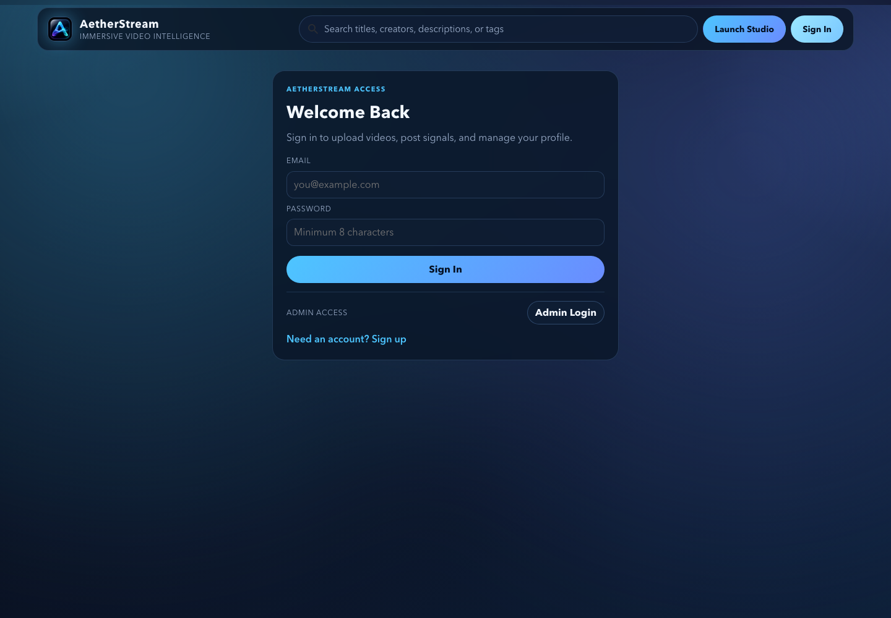
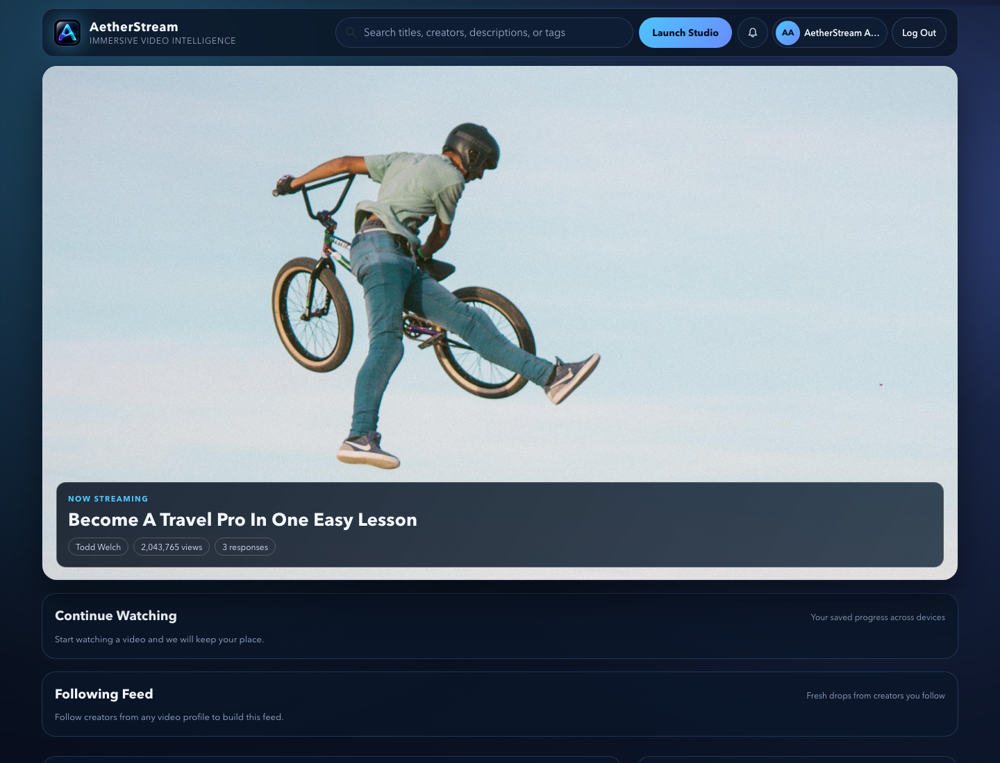
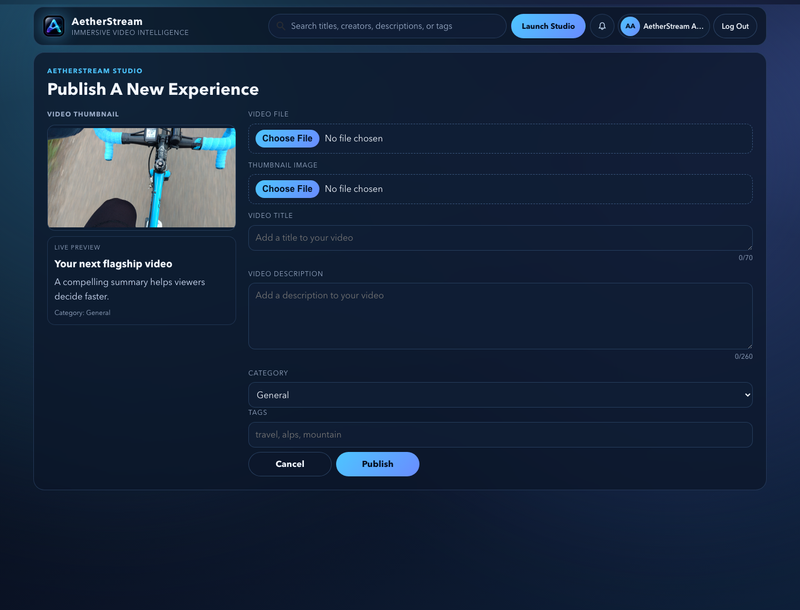
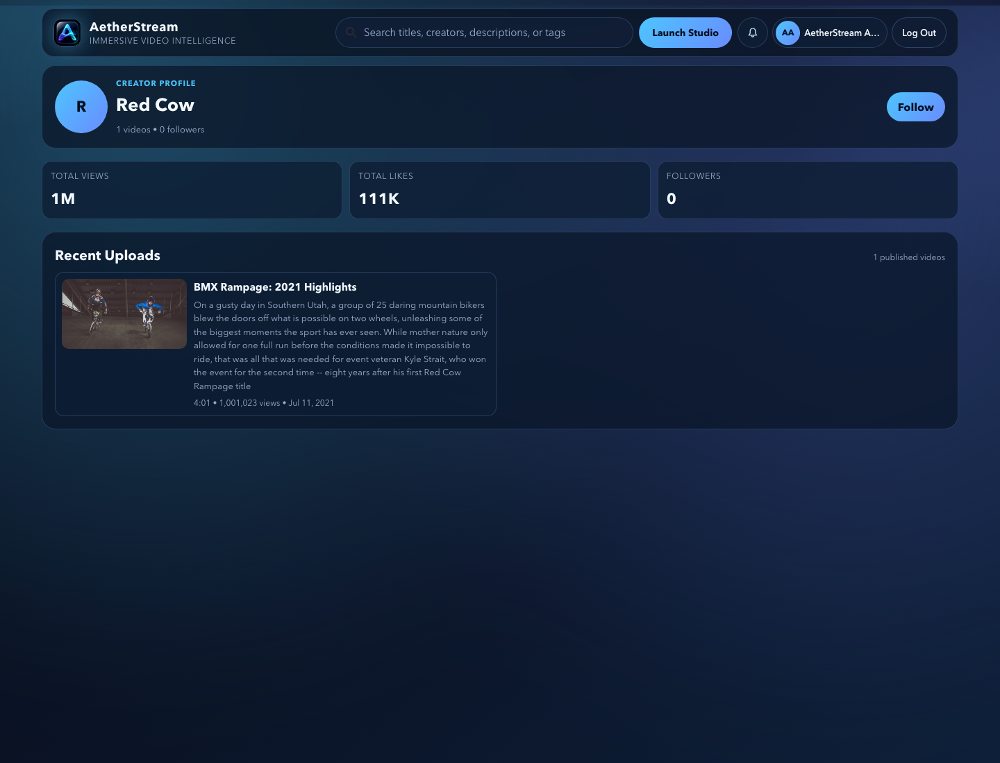
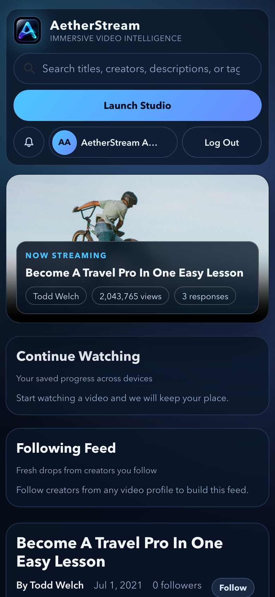
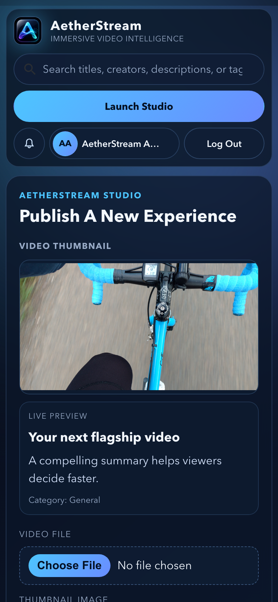

# AetherStream

AetherStream is a polished streaming dashboard built from the BrainFlix app foundation. It pairs a cinematic React client with the companion AetherStream API so viewers can browse video content while creators can publish, manage, and measure their work.

## What It Does

- Presents a branded streaming shell with responsive navigation, search, notifications, and protected routes.
- Streams featured video content with a poster-backed hero player, engagement chips, comments, likes, saves, and watch-progress tracking.
- Supports creator discovery with profile pages, follow actions, recent uploads, and creator-level metrics.
- Provides an authenticated creator studio for profile updates, video management, saved videos, watch history, and analytics windows.
- Includes an upload workflow with video file selection, thumbnail selection, live preview, validation, and upload progress.
- Includes a local admin demo login to review and update authenticated app states quickly during development.
- Maintains dependencies through Dependabot and explicit npm audit scripts.

## Screenshots

Captured from the local app with Chrome headless after signing in through the admin demo login where authentication was needed.

### Desktop

| Access | Home |
| --- | --- |
|  |  |

| Upload Studio | Creator Profile |
| --- | --- |
|  |  |

| Admin Profile |
| --- |
|  |

### Mobile

| Home | Profile | Upload |
| --- | --- | --- |
|  |  |  |

## Local Development

This client expects the companion API to run on `http://localhost:8080/`. The API URL currently lives in `src/components/utilities/Utilities.js`.

Start the API from the sibling server repo:

```bash
cd ../nicholas-kerr-aetherstream-server
npm install
npm start
```

Start the client from this repo:

```bash
npm install
npm start
```

The client runs at `http://localhost:3000/`.

## Admin Demo Login

The access screen includes an `Admin Login` action for local review. It signs into the seeded admin account exposed by the companion API so authenticated flows can be tested without manually creating a user.

Use it for development screenshots, profile updates, upload flow checks, analytics views, notification checks, and protected-route verification.

## Scripts

```bash
npm start
npm run build
npm run audit
npm run audit:prod
npm run audit:fix
```

- `npm start` launches the React development server.
- `npm run build` creates a production build.
- `npm run audit` checks the full dependency tree.
- `npm run audit:prod` checks production dependencies only.
- `npm run audit:fix` applies npm's available safe audit fixes.

## Maintenance

Dependabot is configured in `.github/dependabot.yml` to check npm dependencies and GitHub Actions weekly. Minor and patch dependency updates are grouped into safe review PRs, while major version upgrades are left for manual review.

Before merging dependency updates, run:

```bash
npm run build
npm run audit:prod
```
